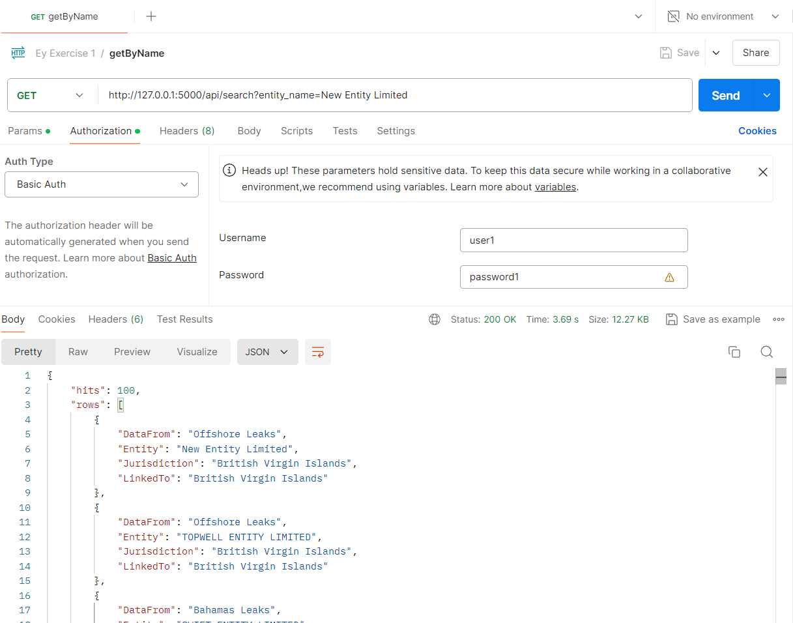

# Web Scraping exercise 1 
## [Offshore Leaks Database](https://offshoreleaks.icij.org/)
### To Run the project
1. Create the virtual environment  
`python -m venv venv`

2. To activate venv (Windows)  
`venv\Scripts\activate`

3. Install the dependecies for the project  
`pip install -r requirements.txt`

4. To run the project  
`flask --app app.py run`

5. Running in port  
`http://127.0.0.1:5000`

6. Endpoint and Example  
 *  Endpoint  
`http://127.0.0.1:5000/search?entity_name={entity_name}`

 * Example  
 * * `http://127.0.0.1:5000/search?entity_name=New Entity Limited`  

 * * `http://127.0.0.1:5000/search?entity_name=LYNWARD INC.`

7. Postman Image

# Despliegue de Aplicación Flask en Azure usando Web App Service

## Instrucciones de Despliegue

### 1. Crear una Aplicación Web
1. Inicia sesión en el portal de Azure.
2. Navega a "Crear un recurso" > "Web App Service".
3. Configura los detalles necesarios como Suscripción, Grupo de recursos y Nombre de la aplicación.
4. Elige una pila de runtime que soporte Python (por ejemplo, Python 3.8).

### 2. Desplegar el Código
1. Usa Azure DevOps o GitHub Actions para desplegar tu código.
2. Alternativamente, usa la CLI de Azure o el Portal de Azure para subir tu código directamente.

### 3. Configurar la Aplicación
1. En la configuración de la aplicación web, navega a "Configuración" para establecer las variables de entorno.
2. Añade variables para FLASK_APP, secretos de autenticación, etc.

### 4. Configurar el Despliegue
1. Usa el Centro de Despliegue en el Portal de Azure para vincular tu repositorio y configurar el despliegue continuo.

### 5. Escalado y Monitoreo
1. Configura el escalado en las opciones de "Escalar hacia arriba" o "Escalar hacia afuera".
2. Usa "Application Insights" para monitorear el rendimiento de tu aplicación.